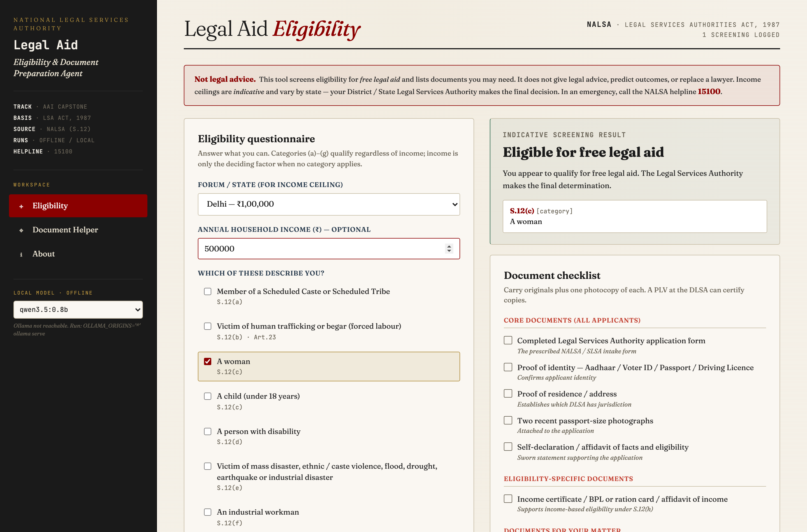
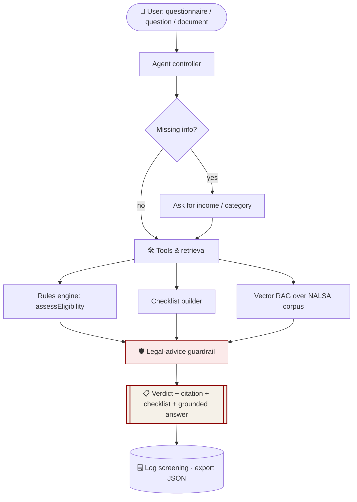
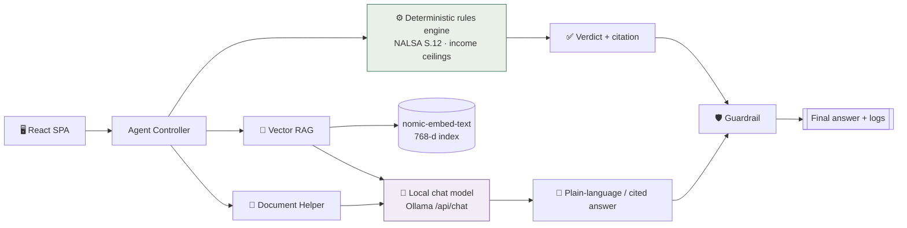
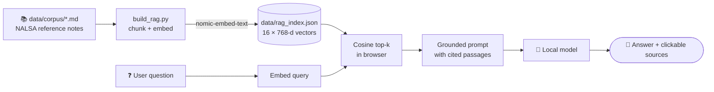
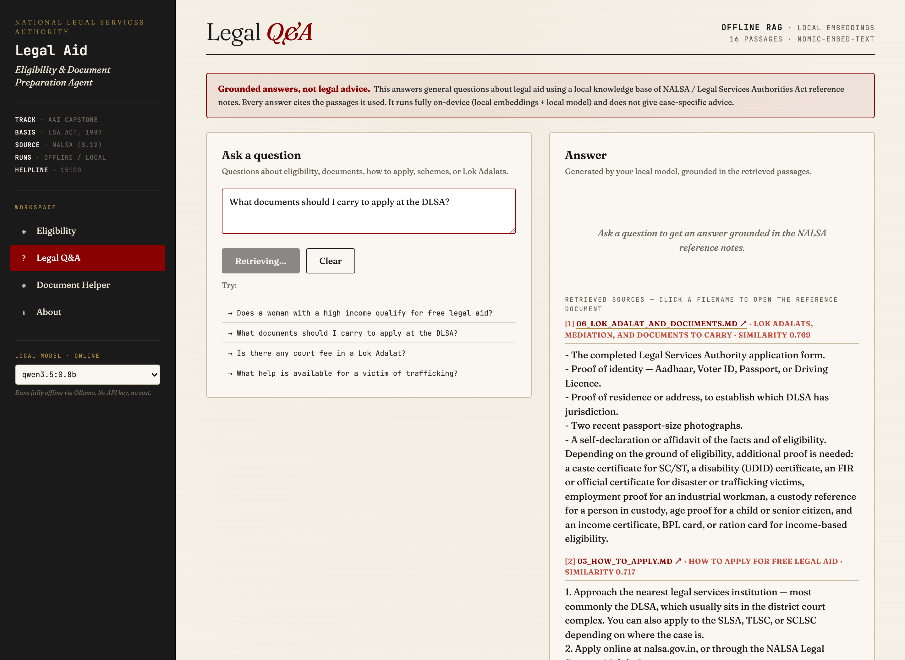
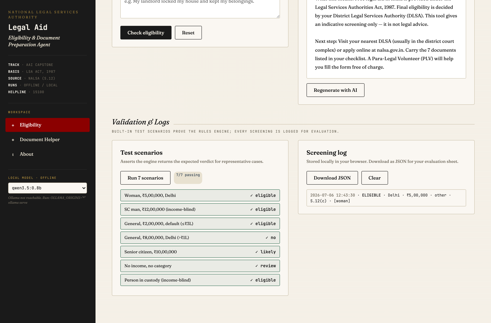

<div align="center">

# ⚖️ Legal Aid Eligibility & Document Preparation Agent

**An offline AI agent that tells a citizen whether they qualify for free legal aid in India, cites the governing law, and builds their document checklist — running entirely on a local model.**


-8b0000?style=for-the-badge)


-8b0000)


</div>

> **Track:** AAI · **Domain:** Access to justice & support navigation · **Reference:** [NALSA](https://nalsa.gov.in/) — Legal Services Authorities Act, 1987 (Section 12)
> Runs **fully offline** on a small local model (Ollama) — no API key, no cost, and **no applicant data ever leaves the device**.

<div align="center">



</div>

---

<div align="center">

## ⚡ Instant launch — one click, zero setup

</div>

> ### 🖱️ &nbsp; Just **double-click [`start.command`](start.command)**
>
> It does everything for you — starts the local AI engine, checks the models, serves the app, and opens it in your browser:
>
> ```text
>    ╔══════════════════════════════════════════════════════════╗
>    ║      ⚖️   LEGAL AID ELIGIBILITY  &  DOCUMENT AGENT        ║
>    ║          NALSA · runs 100% offline · no API key          ║
>    ╚══════════════════════════════════════════════════════════╝
>    [1/4] Starting the local AI engine (Ollama)…      ✓
>    [2/4] Checking local models…                      ✓
>    [3/4] Serving the app at http://localhost:8000 …  ✓
>    [4/4] Opening the app in your browser…            ✓
>    ✓  Ready!   Open →  http://localhost:8000/
> ```
>
> **No terminal. No config. No API keys.** Prefer manual? See [Run it](#-run-it) below.
>
> <sub>First run: if macOS says the file is blocked, **right-click → Open** once (or run `chmod +x start.command`).</sub>

---

## ✨ What it does

| | Feature | How |
|---|---|---|
| ✅ | **Eligibility screening** | A short questionnaire → a **deterministic rules engine** returns an indicative verdict **with the governing NALSA citation** (e.g. `S.12(c)` for a woman, `S.12(h)` for income). |
| 📄 | **Document checklist** | Auto-builds a checklist tailored to the applicant's category *and* matter type. |
| 🔎 | **Legal Q&A (vector RAG)** | Ask a question → local embeddings retrieve the most relevant NALSA passages → the model answers **grounded in and citing** them, with clickable sources. |
| 🧾 | **Document Helper** | Upload a legal notice (PDF/DOCX) → plain-language, 6th-grade explanation, **on-device**. |
| 🛡️ | **Legal-advice guardrail** | Requests for case strategy / outcome predictions are refused with a human hand-off. |
| 🧪 | **Validation & logs** | 7 built-in test scenarios (7/7 passing) + a JSON-exportable screening log. |
| 🔒 | **Privacy by design** | 100% offline: vendored UI + local model. Sensitive intake data stays on the user's machine. |

---

## 🗺️ How it works



### System architecture



### Offline vector RAG pipeline



> The whole pipeline is on-device: the index is built once offline by `build_rag.py`; retrieval and generation at query time use only local embeddings + a local model, and **every answer cites the passages it used**.

---

## 🧠 Model choice — why not the tiny Qwen?

The agent runs on **any** local Ollama model — pick it live in the sidebar dropdown. We benchmarked several on the plain-language + grounded-RAG tasks:

| Model | Size | Verdict |
|---|---|---|
| `qwen3.5:0.8b` | ~1 GB | A **reasoning ("thinking") model**. At 0.8 B it spends its token budget on a hidden chain-of-thought and often returns **empty or garbled** answers for our structured tasks — and its thinking mode can't be reliably disabled over the API. Kept as the *"it literally runs on a 1 GB model"* proof, not for real answers. |
| `llama3.1` | 8 B | Clean and reliable — a solid middle option. |
| **`gemma4:latest`** ⭐ | ~9.6 GB | **Best results for this use case, and the default.** A modern **encoder-free "Unified" decoder-only transformer**, and — empirically — it emits the grounded, cited, plain-language answer straight away with no thinking-mode detour, which is exactly what a legal-aid explainer needs. |

> **Architecture note — what "Unified" (encoder-free) means.** Most multimodal models bolt *dedicated encoders* in front of the LLM to pre-process images/audio. Gemma 4 12B "Unified" removes those encoders entirely, projecting raw image patches and audio waveforms **directly into the LLM's embedding space through lightweight linear layers**. Everything flows into a **single decoder-only transformer**, which lowers multimodal latency and lets the whole model be fine-tuned in one pass. (It is still a transformer — just encoder-free, not "transformer-less".) For this *text-only* task the practical win is its clean, direct instruction-following.

> **Key design point:** the eligibility **verdict is decided by the deterministic rules engine, not the model** — so switching models never changes correctness, only the *wording* of the explanation. That's what makes it safe to run on any local model, tiny or large.

---

## 🚀 Run it

**Prerequisites:** [Ollama](https://ollama.com) and Python 3.

```bash
# 1. Pull models (chat + embeddings)
ollama pull gemma4            # default chat model (best results)
ollama pull llama3.1          # good alternative
ollama pull nomic-embed-text  # embeddings for the Legal Q&A RAG

# 2. Build the RAG index (one-time / after editing data/corpus)
python3 build_rag.py          # writes data/rag_index.json

# 3. Serve + open  ── easiest: double-click start.command (macOS)
python3 serve.py              # then open http://localhost:8000/
```

> ⚠️ **Open it at `http://localhost:8000/`, not by double-clicking the file.** Ollama's CORS policy rejects the `file://` origin, and browser `localStorage` needs an `http` origin. If you just pulled a change and the UI looks stale, hard-reload (**⌘⇧R**).

To edit the app: change `src_app.jsx` → `node build.js` → reload.

---

## 📸 Screenshots

| Eligibility + checklist | Mutually-exclusive categories |
|---|---|
|  |  |
| **Legal Q&A — grounded, cited RAG** | **Validation — 7/7 scenarios** |
|  |  |

---

## 🧩 AI / agent component (where AI is used, and why)

- **Deterministic core (software logic):** eligibility + checklist are pure functions — repeatable, auditable, unit-tested. The right engineering choice for a sensitive legal domain.
- **AI layer (local LLM):** *rephrases* the rules-engine verdict into plain, supportive language; powers the **Document Helper**; and answers **Legal Q&A grounded in retrieved NALSA passages** (true vector RAG). The model **never decides eligibility**.
- **Guardrail:** advice/outcome requests are detected and refused, with a hand-off to a human lawyer/PLV.

---

## 📊 Results & insights
- Rules engine passes **7 / 7** built-in scenarios (also in `data/sample_intake.csv`).
- Every verdict cites its governing provision; every RAG answer cites its sources (clickable).
- Runs on a **1 GB** model as proof; `gemma4:latest` gives the cleanest explanations.
- Because eligibility is deterministic, model choice never changes the verdict — only the wording.

## ⚠️ Limitations & responsible use
Indicative screening only — **not legal advice**; income ceilings vary by state and change over time; the Legal Services Authority makes the final decision; small local models are slower on CPU. Full notes: [`docs/limitations_and_responsible_use.md`](docs/limitations_and_responsible_use.md). In an emergency, call the **NALSA helpline 15100**.

## 🔮 Future improvements
Runtime-editable rules/ceilings · expand the RAG corpus with full NALSA circulars + per-state rules and add re-ranking · multilingual (Hindi & regional) output · OCR for scanned documents · one-click PLV hand-off with the screening log attached.

## 📁 Repository structure
```
├── index.html            # the app shell (loads vendored libs + compiled app)
├── src_app.jsx           # editable source  →  build.js  →  vendor/app.js
├── build.js              # JSX → vendor/app.js (classic React runtime, no bundler)
├── build_rag.py          # offline RAG indexer (local embeddings)
├── serve.py              # localhost static server (stdlib, no-cache)
├── start.command         # one-click launcher (Ollama + server + open)
├── data/                 # NALSA reference CSVs + corpus/ + rag_index.json
├── docs/                 # project report, architecture, responsible-use
├── screenshots/          # working-prototype captures
├── vendor/               # React, mammoth, pdf.js, compiled app (all local)
└── requirements.txt
```

## 👥 Team
- **Chandandeep Sharma**
- **Amey Chorge**
- **Neal Balsara**

---
<div align="center">
<sub>Educational AAI capstone · not affiliated with NALSA · provides indicative information only, not legal advice.</sub>
</div>
