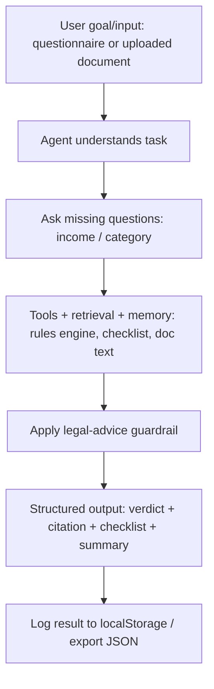
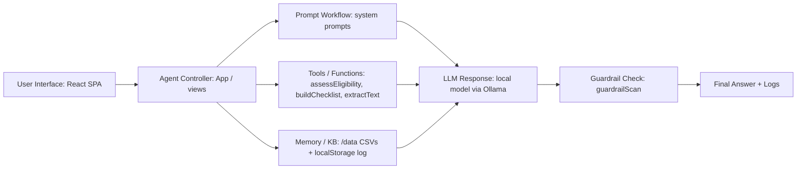
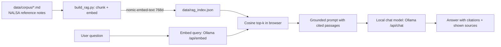

# Architecture

## Project Flow

## System / Pipeline Architecture

## Offline vector RAG (Legal Q&A)

The index is built once, offline, by `build_rag.py`; retrieval and generation at query time are entirely on-device (local embeddings + local model), and every answer cites the passages it used.

## Module map (code)
| Module (brief) | Implementation in `src_app.jsx` |
|---|---|
| User input form | `LegalAidView` questionnaire, `DocumentHelperView` upload/paste |
| Prompt workflow | `DOC_SYSTEM`, the eligibility system prompt in `aiSummary` |
| Tool / function layer | `assessEligibility`, `buildChecklist`, `laCeiling`, `extractText` |
| Memory / retrieval | `localStorage` screening log; `/data` reference tables; **vector RAG** over `data/rag_index.json` (`embedQuery`, `cosineSim`, `RagView`); document text passed to the model |
| Guardrails & fallback | `guardrailScan`; AI-unavailable fallback keeps the rule-based summary |
| Logs / evaluation sheet | screening log + JSON export; `LA_SCENARIOS` test suite |
| AI component | `askModel` → Ollama `/api/chat` (local, offline) |

## Why deterministic core + LLM shell
The eligibility decision is **pure code** so it is correct, repeatable, and testable; the LLM only turns that decision (and uploaded documents) into plain language. The model is never in the decision path, which is the right safety posture for a sensitive legal domain.

## Runtime / serving
- Served over `http://localhost:8000` by `serve.py` (Python stdlib). An `http` origin is required: Ollama's CORS rejects `file://`, and `localStorage` needs an http origin.
- All JS libraries (React, mammoth, pdf.js) and the compiled app are vendored in `/vendor` → the UI works with no internet.
- The model runs locally via Ollama → no API key, no cost, data stays on device.
